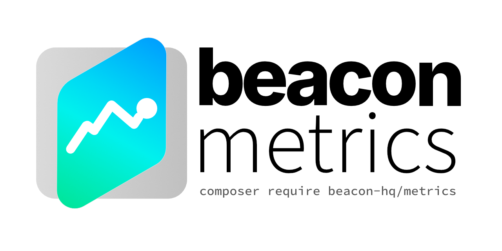

<p align="center">
  
</p>
<p align="center">
  <a href="https://sonarcloud.io/summary/new_code?id=beacon-hq_metrics">
      
  </a>
  <a href="https://sonarcloud.io/summary/new_code?id=beacon-hq_metrics">
      
  </a>
</p>

# Beacon Metrics

Simple metrics and trends for Laravel

## Installation
```bash
composer require beacon-hq/metrics
```

## Features
- PostgreSQL, MySQL, and SQLite support
- Simple value metrics (e.g. count for a month)
- Previous period comparison (e.g. count for this month and last month)
- Trends data (e.g. count per day)
- Grouping

### Supported Aggregates

- count
- sum
- average
- min
- max

### Supported Intervals
- Second
- Minute
- Hour
- Day
- Week
- Month
- Year

## Usage

### Value Metrics

Value metrics are simple single aggregate values and will typically result in a single value.

Value metrics can be calcuted using `Metrics->value()`.

```php
use Carbon\Carbon;
use Beacon\Metrics\Metrics;

$value = Metrics::query(MyModel::query())
    ->count()
    ->between(now()->subMonth(1), now())
    ->value(); // 123
```

You can also get value metrics by group which will result in a Laravel Collection of values keys using the group value.

To enable grouping, use `Metrics->byGroup()`, passing in a column name or a SQL expression (i.e. `DB::raw()`):

```php
use Carbon\Carbon;
use Beacon\Metrics\Metrics;

$value = Metrics::query(MyModel::query())
    ->count()
    ->groupBy('category')
    ->between(now()->subMonth(1), now())
    ->value(); // ['category1' => 123, 'category2' => 456]
```

#### With Previous

A common need is to get the metrics for the current period (e.g. today, this week) and the previous period (e.g. yesterday, last week),
this can be achieved using the `Metric->valueWithPrevious()` method. This will return a Laravel collection.

```php
use Carbon\Carbon;
use Beacon\Metrics\Metrics;

$value = Metrics::query(MyModel::query())
    ->count()
    ->between(now()->subMonth(1), now())
    ->valueWithPrevious();
    /*
     * [
     *   'value' => 100,
     *   'previous' => [
     *       'type' => 'increase',
     *       'value' => 80,
     *       'difference' => 20,
     *       'percentage' => 20,
     *   ],
     * ]
     */
```

### Trend Metrics

Trends metrics allow you to get metrics for intervals of a time period, e.g. every day, every month, or multiples of an interval,
e.g. every third day, every second month.

To set the period, use `Metrics->by*($count)`, e.g. every third day would use `$metrics->byDay(3)`.

Trends will always return a collection, with three keys:

- `labels`: the sorted list of labels, using the formatted date as the label value
- `data`: the corresponding list of values
- `total`: the aggregate total for the entire result set

```php
use Carbon\Carbon;
use Beacon\Metrics\Metrics;

$value = Metrics::query(MyModel::query())
    ->count()
    ->byDay()
    ->between(now()->subWeek(), now())
    ->trends(); 
    /*
     * [
     *  'labels' => [
     *      '2025-04-07', 
     *      '2025-04-08', 
     *      '2025-04-10'
     *  ], 
     *  'data' => [
     *      3, 
     *      6, 
     *      9
     *  ], 
     *  'total' => 18
     * ]
     */
```

#### Fill Missing Values

By default, only dates with results will be returned. To fill in missing values, use `Metrics->fillMissing()`:

```php
use Carbon\Carbon;
use Beacon\Metrics\Metrics;

$value = Metrics::query(MyModel::query())
    ->count()
    ->byDay()
    ->between(now()->subWeek(), now())
    ->trends();
    /*
     * [
     *  'labels' => [
     *      '2025-04-05', 
     *      '2025-04-06', 
     *      '2025-04-07', 
     *      '2025-04-08', 
     *      '2025-04-09',
     *      '2025-04-10',
     *      '2025-04-11',
     *  ], 
     *  'data' => [
     *      0,
     *      0,
     *      3, 
     *      6, 
     *      0,
     *      9,
     *      0
     *  ], 
     *  'total' => 18
     * ]
     */
```

#### Percentage Values

To get results in percentages rather than absolute values, set the `$inPercent` argument to true when
calling `Metrics->trends()`.

Percentages are returned as a float with up to 2 decimal places.

### Custom Queries

If you want metrics for a sub-set of data (e.g. a single category), you can simply add a `where` clause to the query passed to
the `Metrics::query()` method.

```php
use Beacon\Metrics\Metrics;
use App\Models\MyModel;
 
$query = MyModel::query()->where('category', 'Category Name');;

$value = Metrics::query($builder)
    ->count()
    ->between(now()->subMonth(1), now())
    ->value(); // 123
```

### Indexes

For performance, you need to have appropriate indexes on your tables. The following are recommendations
based on testing, but you should always test with your own data to confirm.

If you are querying _without_ a where clause, for MySQL/MariaDB and SQLite you should have an index on the **date** column (e.g. `created_at`):

```php
Schema::table('your_table', function (Blueprint $table) {
    $table->index('created_at');
});
```

For PostgreSQL, you should have an index on the **date** column (e.g. `created_at`) _and_ the **value** column:

```php
Schema::table('your_table', function (Blueprint $table) {
    $table->index(['created_at', 'value']);
});
```

If you are querying _with_ a where clause, you should also include the **where** column:

> [!WARNING]
> The ordering in the column matters! Your `where` column should be first.

```php
Schema::table('your_table', function (Blueprint $table) {
    $table->index(['your_column', 'created_at']); // MySQL/MariaDB and SQLite
    $table->index(['your_column', 'created_at', 'value']); // PostgreSQL
});
```

### Defaults

#### Aggregate

By default, the package will use the `count` aggregate. If you want to use a different aggregate, you can use the appropriate aggregate method:

- `Metrics->count()`
- `Metrics->sum()`
- `Metrics->average()`
- `Metrics->min()`
- `Metrics->max()`

### Interval

By default, the package will use a one day interval. If you want to use a different interval, you can use the `Metrics->by*()` methods to set the interval:

- `Metrics->bySecond($count)`
- `Metrics->byMinute($count)`
- `Metrics->byHour($count)`
- `Metrics->byDay($count)`
- `Metrics->byWeek($count)`
- `Metrics->byMonth($count)`
- `Metrics->byYear($count)`

#### Date Column

By default, the package will use the `created_at` column for the date column. If you want to use a different column, you can use the
`Metrics->dateColumn()` method to set the column name.

```php
use Carbon\Carbon;
use Beacon\Metrics\Metrics;

$value = Metrics::query(MyModel::query())
    ->dateColumn('updated_at')
    ->count()
    ->between(now()->subMonth(1), now())
    ->value(); // 123
```

#### Date Range

By default, the package will use the previous month as the date range. If you want to use a different date range, you can use the
`Metrics->between()`, `Metrics->from()`, or any of the `Metrics->for*()` methods to set the date range.

